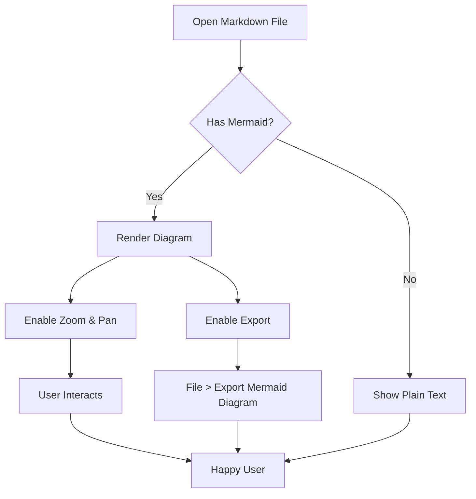
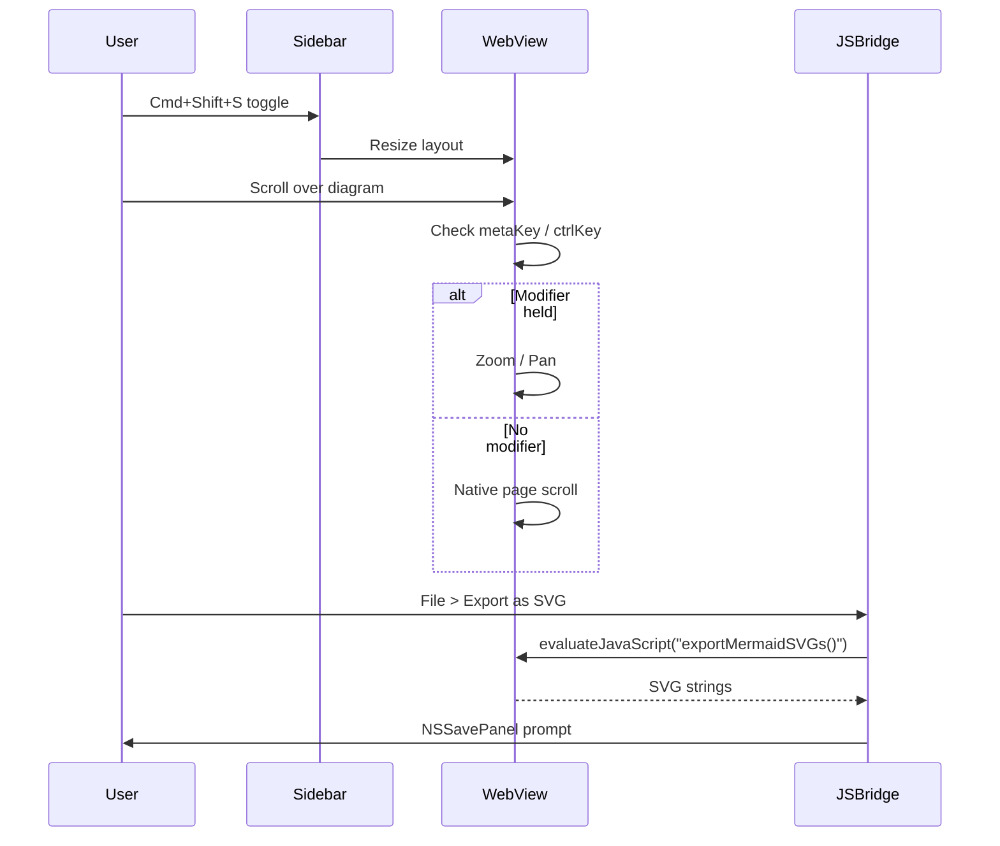
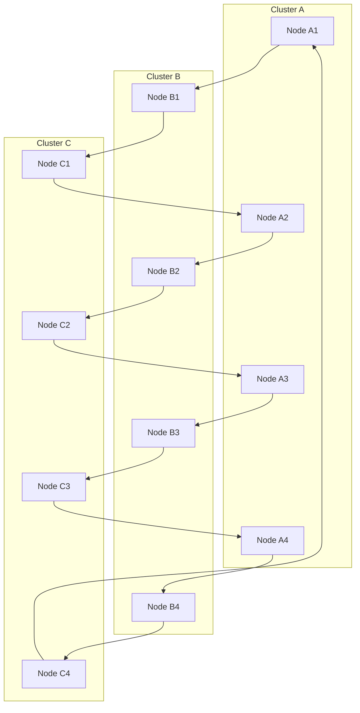

# MDViewer Feature Demo

> This file exercises every feature shipped in v2.3.0, v2.4.0, and v2.5.0.
> Open it in MDViewer and try the sidebar, export, zoom/pan, links, picker, and themes.

---

## Table of Contents

1. [Syntax Highlighting](#syntax-highlighting)
2. [Mermaid Diagrams](#mermaid-diagrams)
3. [Footnotes](#footnotes)
4. [Internal Link Navigation](#internal-link-navigation)
5. [Keyboard Shortcuts Cheat Sheet](#keyboard-shortcuts-cheat-sheet)

---

## Syntax Highlighting

MDViewer bundles highlight.js with 7 theme-mapped styles.

### Swift

```swift
import Foundation

struct DiagramExport {
    let format: ExportFormat
    let url: URL

    func write(svg: String) throws {
        try svg.write(to: url, atomically: true, encoding: .utf8)
    }
}

enum ExportFormat: String, CaseIterable {
    case svg, png
}
```

### JavaScript

```javascript
// The JS bridge called by Swift during export
window.exportMermaidSVGs = function() {
  return Array.from(document.querySelectorAll('pre.mermaid svg')).map((svg, i) => {
    const clone = svg.cloneNode(true);
    if (!clone.getAttribute('xmlns')) {
      clone.setAttribute('xmlns', 'http://www.w3.org/2000/svg');
    }
    return { index: i, svg: new XMLSerializer().serializeToString(clone) };
  });
};
```

### Python

```python
def fuzzy_score(query, text):
    score = 0
    idx = 0
    for ch in query.lower():
        pos = text.lower().find(ch, idx)
        if pos == -1:
            return None
        if pos == idx:
            score += 15  # consecutive bonus
        idx = pos + 1
    return score
```

### JSON

```json
{
  "name": "MDViewer",
  "version": "2.5.0",
  "features": {
    "syntaxHighlighting": true,
    "mermaidExport": true,
    "sidebar": true
  },
  "themes": ["GitHub Light", "GitHub Dark", "Dracula", "Solarized", "Nord", "One Dark", "Catppuccin"]
}
```

### Unknown Language (Graceful Fallback)

```some-made-up-lang
# This language does not exist in highlight.js
# It should render as a plain pre/code block without crashing.
func unknown() -> Void {
    echo "fallback"
}
```

---

## Mermaid Diagrams

### Valid Flowchart

This diagram supports **zoom** (scroll wheel while holding ⌘/Ctrl) and **pan** (click-drag). Try the keyboard too: `+` to zoom in, `-` to zoom out, arrow keys to pan, `0` to reset, `Escape` to exit focus.



### Valid Sequence Diagram



### Invalid Diagram (Error Diagnostics)

The block below contains a deliberate syntax error. MDViewer should display a themed error box with the message, error hash, and the original source preserved — instead of a blank block.

```mermaid
flowchart TD
    A[Start] --> B[End
    # Missing closing bracket above
```

### Large Diagram (Stress Test for Zoom/Pan)



---

## Footnotes

MDViewer now renders footnotes with superscript links and back-links[^1].

Here's a sentence that needs a citation[^2], and another with a longer explanation[^3].

Footnotes work across paragraphs and multiple references to the same note[^2].

[^1]: This is the first footnote. It should appear at the bottom of the document with a back-link (↑) to the reference.
[^2]: A short footnote can be referenced multiple times.
[^3]: Footnotes can contain **rich** _Markdown_ and even `inline code`. The marked-footnote extension handles parsing and the template CSS styles the list.

---

## Internal Link Navigation

Clicking a `.md` link opens the target file in MDViewer. Non-`.md` links are passed through to the system.

### Sibling Files

- [Architecture Overview](architecture.md) — relative sibling link
- [Getting Started Guide](getting-started.md) — another sibling link
- [Back to README](../README.md) — parent directory traversal (blocked if outside base)

### External Links

- [MDViewer on GitHub](https://github.com) — external URL, opens in browser
- [Apple Developer](https://developer.apple.com) — another external link

---

## Keyboard Shortcuts Cheat Sheet

| Shortcut | Action |
|----------|--------|
| `Cmd+Shift+S` | Toggle sidebar |
| `Cmd+B` | Toggle sidebar (alternate) |
| `Cmd+K` | Open fuzzy file picker |
| `Cmd+F` | Find in page |
| `+` (on focused diagram) | Zoom in |
| `-` (on focused diagram) | Zoom out |
| `0` (on focused diagram) | Reset zoom/pan |
| `Escape` (on focused diagram) | Blur diagram |
| `Tab` | Focus next diagram |

---

## Theme Coverage Checklist

Switch themes in **Preferences** and verify:

- [ ] Code blocks change highlight.js theme (light ↔ dark)
- [ ] Mermaid error box uses theme-appropriate colors
- [ ] Sidebar background adapts to macOS appearance
- [ ] Internal link icons (📄) remain visible
- [ ] Footnote separator line matches theme

---

*End of demo. If you see this rendered correctly, all v2.5.0 features are working.*
